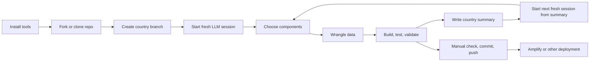

# LLM Quick Start for the GOAP Ocean Accounts Dashboard

This guide is for people who want to *work inside the repo*, use an LLM as a technical copilot, choose dashboard components, ingest data, test changes, and keep a clean country-specific implementation trail.

The existing [README](README.md) covers the general repository setup, country deployment pattern, and Amplify deployment. This guide focuses on the practical LLM-driven development workflow.

## At a glance



## 1. Install an IDE

Use [Visual Studio Code](https://code.visualstudio.com/download) as the example IDE. It is a good fit because this repo is a TypeScript/Next.js project and VS Code works well with terminal-based coding agents.

Recommended setup:

- Install [VS Code](https://code.visualstudio.com/download)
- Read the basic [VS Code setup guide](https://code.visualstudio.com/docs/setup/setup-overview)
- Use the built-in [Source Control view](https://code.visualstudio.com/docs/sourcecontrol/overview)
- Open the integrated terminal in the repo root and keep your agent running there

Suggested local tooling alongside VS Code:

- Node.js 20 LTS
- Git
- One LLM coding agent CLI: Codex, Claude Code, or Gemini CLI

## 2. Make sure Git is installed and connected to your cloud repo

Install Git from [git-scm.com/downloads](https://git-scm.com/downloads/), then set your identity if you have not done that already:

```bash
git config --global user.name "Your Name"
git config --global user.email "you@example.com"
git config --global init.defaultBranch main
```

Useful references:

- Git first-time setup: [git-scm.com book](https://git-scm.com/book/en/v2/Getting-Started-First-Time-Git-Setup.html)
- GitHub SSH setup: [docs.github.com](https://docs.github.com/en/authentication/connecting-to-github-with-ssh)
- GitLab SSH setup: [docs.gitlab.com](https://docs.gitlab.com/user/ssh/)
- Bitbucket cloning and SSH setup: [support.atlassian.com](https://support.atlassian.com/bitbucket-cloud/docs/clone-a-repository/)

If your deployment is linked to the repository, check this **before** you start:

- Which provider owns the deployment: GitHub, GitLab, or Bitbucket etc.
- Which branch triggers builds
- Whether the deployment watches your fork, the main repo, or a specific country branch
- Whether CI/CD or AWS Amplify needs access to secrets, environment variables, or branch rules

> If Amplify is connected to a branch, your push may trigger a live rebuild automatically. Decide your branch strategy first.

## 3. Install your LLM coding tool

You only need one to get started, but these are the three good reference options.

| Tool | Best fit | Official docs | Install |
| --- | --- | --- | --- |
| Codex | Strong fit if you want an agentic terminal workflow tightly aligned with this repo style | [OpenAI Codex CLI docs](https://developers.openai.com/codex/cli) | `npm i -g @openai/codex` |
| Claude Code | Strong fit if you want terminal-first coding plus IDE integrations | [Claude Code getting started](https://code.claude.com/docs/en/getting-started) | `curl -fsSL https://claude.ai/install.sh | bash` |
| Gemini CLI | Strong fit if you want a flexible open-source terminal agent with extensions and session tooling | [Gemini CLI docs](https://geminicli.com/docs/) | `npm install -g @google/gemini-cli` |

Basic launch commands:

```bash
codex
claude
gemini
```

Helpful extras:

- Codex docs also cover the [IDE extension and broader Codex workflow](https://help.openai.com/en/articles/11369540-using-codex-with-your-chatgpt-plan/)
- Claude Code has [IDE integrations](https://code.claude.com/docs/en/ide-integrations)
- Gemini CLI has [IDE integration and context docs](https://geminicli.com/docs/)

## 4. Fork or clone the repo, create a country branch, and open it

If you are working in your own account, fork first. GitHub references:

- [About forks](https://docs.github.com/en/pull-requests/collaborating-with-pull-requests/working-with-forks/about-forks)
- [Cloning a repository](https://docs.github.com/en/repositories/creating-and-managing-repositories/cloning-a-repository)

Then clone and create a branch for your country dashboard:

```bash
git clone <your-fork-or-repo-url>
cd goap-oa-dashboard-template

git switch main
git pull
git switch -c [country-code]

npm install
code .
```

If you forked and also want to track the original repo:

```bash
git remote add upstream <original-repo-url>
git remote -v
```

Useful repo touchpoints for the workflow below:

```text
instructions/AGENT.md
instructions/data_descriptors.md
schemas/
public/data/[country]/
public/data/[country]/raw/
instructions/country_mods/[country].md
```

> `instructions/country_mods/` may not exist yet in a fresh copy. Create it when you start writing country-specific notes.

## 5. Start the first LLM session with the project context

Open a terminal in the repo root and start a fresh session with your chosen LLM. Use this as the initialization prompt:

```text
Read "instructions/AGENT.md" - it's a full description of a framework for a generic ocean accounts dashboard builder. This will give you the project background and some basic knowledge about the project.

Out task now is to...
```

This prompt works because `instructions/AGENT.md` tells the agent:

- what the dashboard framework is
- where the other instructions live
- what data-driven activation patterns already exist
- what quality checks matter before commit or deployment

## 6. Ask the LLM to choose the dashboard components

For an ecosystem extent, condition, and services account, you usually want the LLM to review the existing framework and decide what can be reused, what can be activated by data, and what needs a light extension.

Example prompt:

```text
Read "instructions/AGENT.md" - it's a full description of a framework for a generic ocean accounts dashboard builder. This will give you the project background and some basic knowledge about the project.

The dashboard we want to build is for [country], focused on ecosystem extent, ecosystem condition, and ecosystem services for the national level plus two example sub-national areas: [area 1] and [area 2].

First, inspect the current dashboard framework and identify which existing components and data activation patterns should be used as-is, which should be hidden, and which need to be extended.

Then produce a practical implementation plan and begin configuring the dashboard around this recommended component set:
- National ecosystem extent account
- Sub-national comparison / area selector
- Time series for one or more key extent or condition indicators
- Ecosystem condition summary cards or charts
- Ecosystem services account section
- Natural capital provision / use section if appropriate
- Spatial page cards and map-linked summaries

Keep the framework generic and data-driven. Avoid hardcoding country specifics into components if they should live in data or schema files.

Before making major edits, write the selected component plan and any assumptions to instructions/country_mods/[country].md, creating the folder if needed.
```

## 7. Ask the LLM to wrangle the new data into the repo schema

Use the supplied prompt as the base, but make it more explicit about where the transformed outputs should end up.

```text
There's new data that needs to be ingested, that we will use to modify and/or add components in the dashboard:
- Ecosystem extent, condition and services accounts data for all of [country] and the two example [sub-national areas] - public/data/[country]/raw/new_data.json
- Provision of marine natural capital for all of [country] and useage by some example marine related industries - public/data/[country]/raw/natural_capital_20xx.json

The tasks now is to ingest the new data into the appropriate national and subnational json data sets in /schemas, updating the required structures and schemas as needed.

Please:
1. inspect the existing schemas and data files first
2. map the new source fields to the current dashboard-ready JSON files
3. update schemas only where necessary, keeping the framework generic
4. preserve raw files and write transformed outputs to public/data/[country]/
5. note any assumptions, dropped fields, derived values, or schema changes
6. run the relevant validation checks after the data changes
```

In this repo, the LLM will usually need to inspect some combination of:

- `schemas/national.schema.json`
- `schemas/subnational.schema.json`
- `schemas/timeseries.schema.json`
- `schemas/ecosystemServices.schema.json`
- `schemas/naturalCapital.schema.json`
- `schemas/results.schema.json`
- `public/data/[country]/...`

## 8. Ask the LLM to build, test, and wire up the configured dashboard

Once the component plan and data wrangling are in place, use a prompt like this:

```text
Read "instructions/AGENT.md" - it's a full description of a framework for a generic ocean accounts dashboard builder. This will give you the project background and some basic knowledge about the project.

The selected dashboard components and current country-specific requirements are documented in instructions/country_mods/[country].md.

Now implement the configured dashboard and connect the new data so the selected components render correctly for [country].

Requirements:
- keep the framework generic and data-driven
- prefer configuration and schema changes over hardcoded country logic
- update types, loaders, and component rendering where needed
- ensure the spatial page and dashboard remain coherent
- run and fix issues from:
  - npm run validate-data
  - npm run lint
  - npm run type-check
  - npm run test
  - npm run build

At the end, report:
- files changed
- components added or modified
- data files updated
- tests and build results
- any remaining risks or TODOs
```

## 9. Ask the LLM to summarise the session into a country file

Do this at the end of every meaningful session. It keeps future sessions short and reduces context drift.

Example prompt:

```text
Summarise this session and write the result to instructions/country_mods/[country].md, creating the folder if it does not exist.

Include:
- objective of the session
- dashboard components selected, added, removed, or deferred
- data sources ingested
- schema or type changes
- files changed
- build, lint, test, and validation status
- country-specific implementation decisions
- unresolved issues, risks, or follow-up tasks
- a short suggested prompt for the next session

Keep it concise but specific enough that a new LLM session can continue from it without re-reading the entire chat history.
```

## 10. Keep context under control and use fresh sessions

Do not keep one session running forever. The clean pattern is:

1. work on one bounded objective
2. summarise it into `instructions/country_mods/[country].md`
3. start a new session
4. reload project context plus the country summary

Use this fresh-session prompt:

```text
Read "instructions/AGENT.md" - it's a full description of a framework for a generic ocean accounts dashboard builder. This will give you the project background and some basic knowledge about the project. The current state of this repo reflects the changes and requirements described in instructions/country_mods/[country].md
```

Good habits:

- keep each session focused on one main change set
- ask the LLM to write summaries instead of pasting long chat histories forward
- attach or point to only the raw data files needed for the current task
- start a fresh session when the objective changes from planning to implementation, or from data wrangling to UI work

## 11. Manually test, then commit and push

The LLM should already be running checks, but you should still inspect the app yourself.

Recommended commands:

```bash
npm run dev
```

Then check the local app at `http://localhost:3000` and review:

- national view
- sub-national selector behavior
- new components and charts
- spatial page linkages
- narrative and image assets
- browser console for obvious runtime errors

Before commit, run:

```bash
npm run validate-data
npm run lint
npm run type-check
npm run test
npm run build
```

Then commit and push:

```bash
git status
git add .
git commit -m "Implement [country] dashboard updates"
git push -u origin [country-code]
```

Typical deployment pattern for this repo:

- local work and review with `npm run dev`
- push to the linked repository branch
- AWS Amplify rebuilds automatically on push if the branch is connected

If deployment is manual instead of branch-linked, build the bundle and deploy it through your chosen host.

## 12. Repeat steps 6-10

This is the normal loop:

1. choose or refine components
2. wrangle or extend data
3. implement and test
4. summarise to `instructions/country_mods/[country].md`
5. start a fresh session from that summary

That loop is usually safer and more productive than trying to do the entire country dashboard in one long conversation.

## Suggested working pattern

```text
Session 1: choose components and record the plan
Session 2: wrangle data and update schemas
Session 3: implement dashboard components
Session 4: refine charts, copy, and spatial linkages
Session 5: validate, test, and prepare deployment
```

## Final note

This framework is already designed to be **generic, data-driven, and branch-based**. The most effective use of an LLM here is not to ask it to invent a dashboard from scratch, but to ask it to:

- inspect the existing framework first
- reuse hidden or data-activated components where possible
- keep country specifics in data files and summaries
- validate everything before you push to a deployment branch
